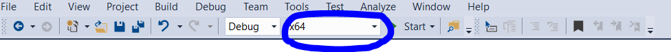

# Cold Physics Experiments Control Software (CPECS)

This repository maintains a software used to control physical experiments related to very cold molecules and atoms.

## Features

### Main Features
__TODO__ A short description of the main features of this software should be placed here

### Details
The features of this software are documented in the [Wiki](https://github.com/coldphysics/software-control/wiki).

## Information for Users

In this section, various information for end-users are provided.

### Prerequesits
Please consider the following prerequisits before installing CPECS.

#### Programs that must be installed alongside CPECS
  1. [IronPython](https://github.com/IronLanguages/ironpython2/releases/download/ipy-2.7.9/IronPython-2.7.9.msi)
  2. __IT IS NOT REQUIRED__ to install MySql Connector locally, the required libraries are included in the program.

#### Additional prerequisits for AdWin users
  1. Download and install the [ADwin software package](https://www.adwin.de/us/download/cdrom.html)

#### Additional prerequesets for NationalInstruments users
  1. Install the driver software [NI-DAQmx 19.6](https://www.ni.com/en-us/support/downloads/drivers/download.ni-daqmx.html)
  2. Ensure that the analog and digital cards are named according to the expectations of CPECS, i.e, digital cards are named DO1, DO2, .. while 
     analog cards are named: AO1, AO2, ...
  3. Configure the master card (depends on the setup).

### How to add a new issue?
  0. Make sure the issue is not added already.
  1. Go to the [`Issues`](https://github.com/coldphysics/software-control/issues) tab.
  2. Click on `New Issue`.
  3. Start with a new `Bug report`.
  4. Fill-in the proposed template with the bug details. Remove any unused sections.
  5. Add additional labels if necessary, e.g., AdWin or NationalInstuments or both.
  
### How to add a new feature request?
  0. Make sure the feature request is not added already.
  1. Go to the [`Issues`](https://github.com/coldphysics/software-control/issues) tab.
  2. Click on `New Issue`.
  3. Start with a new `Feature request`.
  4. Fill-in the proposed template with the bug details. Remove any unused sections.
  5. Add additional labels if necessary, e.g., AdWin or NationalInstuments or both.
  
### How to document a feature?
Please use the [Wiki](https://github.com/coldphysics/software-control/wiki).

### How to obtain an executable installer for CPECS?
__TODO__
  
## Information for Developers

In this section, various information for developers are provided.

### Mandatory Prerequisits

  1. Install [IronPython](https://github.com/IronLanguages/ironpython2/releases/download/ipy-2.7.9/IronPython-2.7.9.msi)
  2. Obtain the following DLLs, which are required for building the project [(check where to obtain them)](#how-to-obtain-the-additional-dlls-required-for-building-the-project):
     1. ADwin.Net-Driver: `ADwin.Driver.dll` - Version: 1.059
     2. National Instruments Common: `NationalInstruments.Common.dll` - Version: 9.1.40.159
     3. National Instruments Common Native Library: ``NationalInstruments.Common.Native.dll`` - Version: 9.1.40.159
     4. DAQmx API for Measurement Studio: ``NationalInstruments.DAQmx.dll`` - Version: 9.4.40.50
     5. National Instruments Common: ``NationalInstruments.Common.dll`` - Version: 9.1.40.159
     6. ``NationalInstruments.MStudioCLM.dll`` - Version: 15.1.40.49152
     7. ``NationalInstruments.NiLmClientDLL`` - Version: 15.1.40.49152 
     8. MySql .Net Connector: ``mysql.data.dll`` - Version: 6.9.10
  3. Install an IDE __that supports building .Net Framework 4.5 applications, and that supports [NuGet](https://www.nuget.org/)__:
     - Both _Visual Studio 2013 Professional_, and _Visual Studio 2017 Enterprise_ were tested.
     - _Visual Studio Community_ editions are supposed to work as well.
     - _Build Tools for Visual Studio_ could probably work as well.

### Recommended Plugins for Visual Studio
  
  1. [Github Extension for Visual Studio](https://visualstudio.github.com/)
  2. [Visual Studio IntelliCode](https://marketplace.visualstudio.com/items?itemName=VisualStudioExptTeam.VSIntelliCode)
  3. [Markdown Editor](https://marketplace.visualstudio.com/items?itemName=MadsKristensen.MarkdownEditor)
  4. If you want to get the `Documentation` project recognized by visual studio, you must install [Sandcastle Help File Builder and Tools](https://github.com/EWSoftware/SHFB). The latest release that still supports Visual Studio 2013 [can be obtained here](https://github.com/EWSoftware/SHFB/releases/tag/v2017.1.28.0).

### How Tos

#### How to obtain the additional DLLs required for building the project?
A set of DLLs have strict usage licenses that prevents providing access to them in a public repository.
Nonetheless, they are required for the successful building and publishing of CPECS. To obtain these DLLs:
  - If you are a member of the [PI5](https://www.pi5.uni-stuttgart.de/), you can obtain them from [this SVN folder]() __TODO__
  - Otherwise, please obtain them from the original providers:
    - [ADwin software package](https://www.adwin.de/us/download/cdrom.html)
    - [NI-DAQmx 19.6](https://www.ni.com/en-us/support/downloads/drivers/download.ni-daqmx.html). Further details: [here](https://knowledge.ni.com/KnowledgeArticleDetails?id=kA00Z0000019Ma3SAE&l=en-US), and [here](https://www.ni.com/en-us/support/documentation/supplemental/13/national-instruments--net-support.html)
    - [MySQL Connector/NET](https://downloads.mysql.com/archives/get/p/6/file/mysql-connector-net-6.9.10-noinstall.zip)

Make sure you obtain class libraries, i.e., dlls, that are compatible with the x64 architecture. [see details here for NI dlls](http://zone.ni.com/reference/en-XX/help/370473J-01/ninetdaqmxfx40/netdaqmx64bitsupport/). 

#### How to build the project for the first time (e.g., using Visual Studio 2017)?
  1. Fulfil the [prerequisits](#prerequisits) mentioned earlier.
  2. Clone this repository to a local directory.
  3. Copy the additional dlls (mentioned in the prerequisits) to the folder named `libs` at the root level of the cloned repository.
  4. Open the solution in Visual Studio (the solution file is located under: `MainProject\ComputerControl.sln`)
  5. Make sure the project called `MainProject` is set as the startup project: In the `Solution Expolorer` window, right-click on the project, and select `Set as Startup Project`.
  6. Make sure that the selected build architecture is `x64` (otherwise, memory-related exceptions will happen) 
  7. Restore NuGet packages. This will retrieve dynamically referenced DLL files from online repositories (Right-click on the solution node in the solution explorer and click on ``Restore NuGet Packages``).
  8. Press `F6` to start building the solution.
  9. Cross your fingers. Die Daumen drucken. Say some prayers.. And hopefully this will work!

#### How to create a new release of CPECS?
__TODO__

#### How to introduce changes to the data model while maintaining backward-compatibility?
__TODO__

#### How to introduce changes to the data model of the user profiles?
__TODO__

