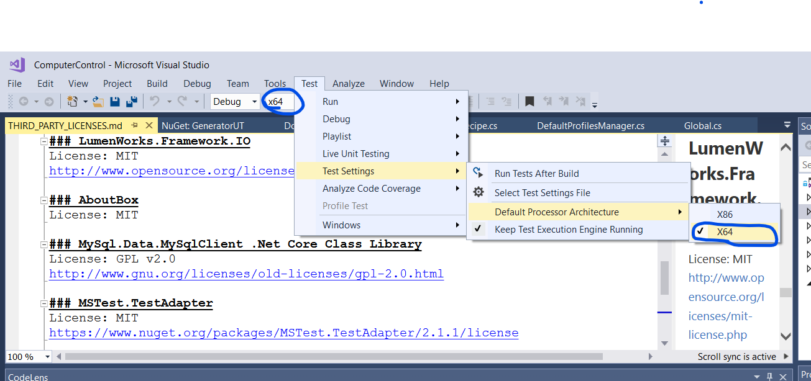

# Cold Physics Experiments Control Software (CPECS)

This repository maintains a software used to control physical experiments related to very cold molecules and atoms.

## Table of Contents
  * [Features](#features)
    + [Main Features](#main-features)
    + [Details](#details)
  * [Information for Users](#information-for-users)
    + [Prerequesits](#prerequesits)
      - [Prerequisits for all users](#prerequisits-for-all-users)
      - [Additional prerequisits for AdWin users](#additional-prerequisits-for-adwin-users)
      - [Additional prerequesets for NationalInstruments users](#additional-prerequesets-for-nationalinstruments-users)
    + [How To's](#how-tos)
      - [How to add a new issue?](#how-to-add-a-new-issue)
      - [How to add a new feature request?](#how-to-add-a-new-feature-request)
      - [How to document a feature?](#how-to-document-a-feature)
      - [How to obtain an executable installer for CPECS?](#how-to-obtain-an-executable-installer-for-cpecs)
      - [How to configure the database?](#how-to-configure-the-database)
  * [Information for Developers](#information-for-developers)
    + [Mandatory Prerequisits](#mandatory-prerequisits)
    + [Recommended Plugins for Visual Studio](#recommended-plugins-for-visual-studio)
    + [How To's](#how-tos-1)
      - [How to obtain the additional DLLs required for building the project?](#how-to-obtain-the-additional-dlls-required-for-building-the-project)
      - [How to build the project for the first time (e.g., using Visual Studio 2017)?](#how-to-build-the-project-for-the-first-time-eg-using-visual-studio-2017)
      - [How to run all unit tests?](#how-to-run-all-unit-tests)
      - [How to create a new release of CPECS?](#how-to-create-a-new-release-of-cpecs)
      - [How to introduce changes to the data model while maintaining backward-compatibility?](#how-to-introduce-changes-to-the-data-model-while-maintaining-backward-compatibility)
      - [How to introduce changes to the data model of the user profiles?](#how-to-introduce-changes-to-the-data-model-of-the-user-profiles)
      
## Features

### Main Features
__TODO__ A short description of the main features of this software should be placed here

### Details
The features of this software are documented in the [Wiki](https://github.com/coldphysics/software-control/wiki).

## Information for Users

In this section, various information for end-users are provided.

### Prerequesits
Please consider the following prerequisits before installing CPECS.

#### Prerequisits for all users
  1. Install [IronPython](https://github.com/IronLanguages/ironpython2/releases/download/ipy-2.7.9/IronPython-2.7.9.msi)
  2. __IT IS NOT REQUIRED__ to install MySql Connector locally, the required libraries are included in the program.
  3. If the message "Your security settings do not allow this application to be installed on your computer" or a similar message shows when trying to install the application, you need to [follow this fix](https://superuser.com/a/1252757). The reason is that atm no officail software signing certifcate is being used to prove the authenticity of the application.
  4. Ports `7200` and `7205` must be available (to receive errors over the network, e.g., from python scripts)

#### Additional prerequisits for AdWin users
  1. Download and install the [ADwin software package](https://www.adwin.de/us/download/cdrom.html)
  2. Make sure that the adwin device #1 is set and available.

#### Additional prerequesets for NationalInstruments users
  1. Install the driver software [NI-DAQmx 19.6](https://www.ni.com/en-us/support/downloads/drivers/download.ni-daqmx.html)
  2. Ensure that the analog and digital cards are named according to the expectations of CPECS, i.e, digital cards are named DO1, DO2, .. while 
     analog cards are named: AO1, AO2, ...
  3. Configure the master card (depends on the setup).

### How To's

#### How to add a new issue?
  0. Make sure the issue is not added already.
  1. Go to the [`Issues`](https://github.com/coldphysics/software-control/issues) tab.
  2. Click on `New Issue`.
  3. Start with a new `Bug report`.
  4. Fill-in the proposed template with the bug details. Remove any unused sections.
  5. Add additional labels if necessary, e.g., AdWin or NationalInstuments or both.
  
#### How to add a new feature request?
  0. Make sure the feature request is not added already.
  1. Go to the [`Issues`](https://github.com/coldphysics/software-control/issues) tab.
  2. Click on `New Issue`.
  3. Start with a new `Feature request`.
  4. Fill-in the proposed template with the bug details. Remove any unused sections.
  5. Add additional labels if necessary, e.g., AdWin or NationalInstuments or both.
  
#### How to document a feature?
Please use the [Wiki](https://github.com/coldphysics/software-control/wiki).

#### How to obtain an executable installer for CPECS?
If you are a member of the [coldphysics organization](https://github.com/coldphysics), you can obtain released installers from [this private repository](https://github.com/coldphysics/releases).
Details about all releases can be found [here](https://github.com/coldphysics/experiment-control/releases).

Alternatively, you will need to build the code and create an installer yourself (see the [developer information](#information-for-developers) below).

#### How to configure the database?
The application can create entries in a database that correspond to the variables and other aspects of each cycle being executed.
CPECS is programmed to communicate with a [MySql](https://dev.mysql.com/downloads/) database management system instance.
The application uses password authentication __(SSL is not supported)__.
CPECS stores its entries in a table with the following schema (the name of the database, the server, and the table are arbitrary and can be configured from the user profiles):

| Column Name             | Data Type  | Description  |
|-------------------------|------------|---|
| `globalCounter`         | `VARCHAR`  | The value of the global counter of the cycle.  |
| `startTime`             | `DATETIME` | The datetime at which the current cycle started.  |
| `startCounterOfScans`   | `VARCHAR`  | The value of the global counter when the current set of cycles started, e.g., when the user clicked on _Start_  |
| `iterationOfScan`       | `VARCHAR`  | The value of the current iteration whithin the current set of cycles.  |
| `completedScans`        | `VARCHAR`  | The number of times the whole set of iterator variables reached their final values, i.e, the number of complete scans.  |
| `numberOfIterations`    | `VARCHAR`  | The total number of iterations for the current scan.|
| `Variables`             | `VARCHAR`  | A comma-separated list of key-value pairs each corresponding to a user-defined variable of any kind (static, iterator, dynamic). The list also contains some other key-value pairs such as the cycle duration.  |
| `iterators`             | `VARCHAR`  | A comma-separated list of key-value pairs each corresponding to a user-defined iterator variable.  |
| `operatingMode`         | `VARCHAR`  | `'0'`: static mode, `'1'`: iterating mode, `'2'`: measurement routine mode  |
| `startCounterOfRoutine` | `VARCHAR`  | If in routine mode: the value of the global counter when the routine started.  |
| `modelNumber`           | `VARCHAR`  | If in routine mode: the 0-based index of the current model within the measurement routine.|
| `routineArray`          | `VARCHAR`  | If in routine mode: a comma-separated list of the contents of the `routineArray` used to get messages in/and out of the measurement routine script.  |

In the active user profile, you can specifiy whther or not to store entries to this table, and how to connect to it.
You can also test the connection parameters from the user profiles UI.
For new experiments, the option `Use Legacy Database Structure` should always be unticked.
  
## Information for Developers

In this section, various information for developers are provided.

### Mandatory Prerequisits

  1. Install [IronPython](https://github.com/IronLanguages/ironpython2/releases/download/ipy-2.7.9/IronPython-2.7.9.msi)
  2. Obtain the following DLLs, which are required for building the project [(check where to obtain them)](#how-to-obtain-the-additional-dlls-required-for-building-the-project):
     1. ADwin.Net-Driver: `ADwin.Driver.dll` - Version: 1.059
     2. National Instruments Common: `NationalInstruments.Common.dll` - Version: 9.1.40.159
     3. National Instruments Common Native Library: ``NationalInstruments.Common.Native.dll`` - Version: 9.1.40.159
     4. DAQmx API for Measurement Studio: ``NationalInstruments.DAQmx.dll`` - Version: 9.4.40.50
     5. National Instruments Common: ``NationalInstruments.Common.dll`` - Version: 9.1.40.159
     6. ``NationalInstruments.MStudioCLM.dll`` - Version: 15.1.40.49152
     7. ``NationalInstruments.NiLmClientDLL`` - Version: 15.1.40.49152
  3. Install an IDE __that supports building .Net Framework 4.5 applications, and that supports [NuGet](https://www.nuget.org/)__:
     - Both _Visual Studio 2013 Professional_, and _Visual Studio 2017 Enterprise_ were tested.
     - _Visual Studio Community_ editions are supposed to work as well.
     - _Build Tools for Visual Studio_ could probably work as well.

### Recommended Plugins for Visual Studio
  
  1. [Github Extension for Visual Studio](https://visualstudio.github.com/)
  2. [Visual Studio IntelliCode](https://marketplace.visualstudio.com/items?itemName=VisualStudioExptTeam.VSIntelliCode)
  3. [Markdown Editor](https://marketplace.visualstudio.com/items?itemName=MadsKristensen.MarkdownEditor)
  4. If you want to get the `Documentation` project recognized by visual studio, you must install [Sandcastle Help File Builder and Tools](https://github.com/EWSoftware/SHFB). The latest release that still supports Visual Studio 2013 [can be obtained here](https://github.com/EWSoftware/SHFB/releases/tag/v2017.1.28.0).

### How To's

If not mentioned otherwise, the following howtos assume the usage of Microsoft Visual Studio as an IDE.

#### How to obtain the additional DLLs required for building the project?
A set of DLLs have strict usage licenses that prevents providing access to them in a public repository.
Nonetheless, they are required for the successful building and publishing of CPECS. To obtain these DLLs:
  - If you are a member of the [coldphysics organization](https://github.com/coldphysics), you can obtain them from [this private repository](https://github.com/coldphysics/private_dlls)
  - Otherwise, please obtain them from the original providers:
    - [ADwin software package](https://www.adwin.de/us/download/cdrom.html)
    - [NI-DAQmx 19.6](https://www.ni.com/en-us/support/downloads/drivers/download.ni-daqmx.html). Further details: [here](https://knowledge.ni.com/KnowledgeArticleDetails?id=kA00Z0000019Ma3SAE&l=en-US), and [here](https://www.ni.com/en-us/support/documentation/supplemental/13/national-instruments--net-support.html)

Make sure you obtain class libraries, i.e., dlls, that are compatible with the x64 architecture. [see details here for NI dlls](http://zone.ni.com/reference/en-XX/help/370473J-01/ninetdaqmxfx40/netdaqmx64bitsupport/). 

#### How to build the project for the first time (e.g., using Visual Studio 2017)?
  1. Fulfil the [prerequisits](#prerequisits) mentioned earlier.
  2. Clone this repository to a local directory.
  3. Copy the additional dlls (mentioned in the prerequisits) to the folder named `libs` at the root level of the cloned repository.
  4. Open the solution in Visual Studio (the solution file is located under: `MainProject\ComputerControl.sln`)
  5. Make sure the project called `MainProject` is set as the startup project: In the `Solution Expolorer` window, right-click on the project, and select `Set as Startup Project`.
  6. Make sure that the selected build architecture is `x64` (otherwise, memory-related exceptions will happen) 
  7. Restore NuGet packages. This will retrieve dynamically referenced DLL files from online repositories (Right-click on the solution node in the solution explorer and click on ``Restore NuGet Packages``).
  8. Press `F6` to start building the solution.
  9. Cross your fingers. Die Daumen drucken. Say some prayers.. And hopefully this will work!
  
#### How to run all unit tests?
Unit testing allows to make sure that existing application features are still functioning as expected despite newly introduced features.
CPECS includes a set of unit tests that should be executed before any new release.
To execute all unit tests in the solution follow these steps:

  1. Ensure that the default testing processor architecture and the solution platform match, i.e., x64:

  2. Click on the `Test` menu button then `Run>All Tests`, or simply use the key combination `Ctrl+R,A`.
  3. Ensure that all tests shown in the `Test Explorer` window run successfully, otherwise, fix the causing errors.

#### How to create a new release of CPECS?
0. Ensure you are a member of the organization!
1. [Make sure that all tests run successfully](#how-to-run-all-unit-tests)
2. Update the software version:
   1. In VS's Solution Explorer, right click on the `MainProject` project and click on `Properties`.
   2. In the `Application` window click on `Assembly Information`.
   3. Update the version according to the [semantic versioning rules](https://semver.org/) (ignore the revision value by setting it to 0)
   4. Change the window to `Publish`
   5. Change the `Publish Version` to match the one you set for the assembly (also igonre the revision value by setting it to 0)
   6. Save all open files
3. Generate application installer
   1. While still on the `Publish` window, click on `Publish Wizard`
   2. Select a local path in which you would like the installer to be placed (the folder must be named `v[version]`, e.g., `v1.4.1`).
  3. Finish the remaining steps of the wizard and click finish. The installer will be placed in the path you specified. 
4. Create a binary release by adding, committing and pushing the folder containing the installer (generated in step 3) to the [private release repository](https://github.com/coldphysics/releases).
5. Add, commit and push latest changes of the codebase to Github (__ensure the installer is not pushed to Github!!__)
6. Generate an apropriate changelog to describe the changes made since the last release. For example, you can use the tool [github-changelog-generator](https://github.com/github-changelog-generator/github-changelog-generator).
7. Create a code release in Github
   1. [Click here](https://github.com/coldphysics/experiment-control/releases/new) to start a new code release.
   2. Name the release according to this convention [Software name][SPACE][version] (e.g., `CPECS v1.4.0`)
   3. In the description place the changelog and enhance it if necessary.
   4. Add a link to the folder containing the installer files in the private repository.
   5. Click on `Publish Release`.
6. Done!

#### How to introduce changes to the data model while maintaining backward-compatibility?
The application uses [basic C# XML serialization](https://docs.microsoft.com/en-us/dotnet/csharp/programming-guide/concepts/serialization/#basic-and-custom-serialization).
It is very important for future versions of the application to keep the compatibility for models created in older versions of the application, since they might be still in-use by some experiments.
However, introducing certain changes to the data model, i.e., classes of the `Model` namespace, can cause the program to fail to deserialize older model files.
Therfore, when having to introduce such changes to the model, the following procedure must be used to maintain backward-compatibility of the application __Before Actually Introduce Any Changes!__:

 1. Create a subfolder/namespace withing the `Model` project with the name `V[X]` where `[X]` stands for the version number of the model before increasing it, e.g., if the current version is 5 and you want to bump it up to 6, the namespace would be `Model.V5`. (Consult `Model.Root.RootModel` class to figure out the current version).
 2. Copy all model classes into this new folder. At the time of writing this document, these classes correspond to the following namespaces: `Model.BaseTypes`, `Model.Root`, `Model.Data`, and `Model.Variables`.
 3. Ensure that all classes within the new namespace have their namespace changed to be inside: `Model.V[x]`, instead of just `Model`.
 4. Ensure that if a model class uses another model class, it uses the correct version thereof, e.g., the `Model.V1.Data.Card.CardBasicModel` uses `Model.V1.Data.Channels` but not `Model.Data.Channels`. For steps (3-4), a find-and-replace operation of `'Model'` with `'Model.V[X]'` could be helpful. Just ensure to apply it to the current folder, not all over the project!
 5. Increase the version number in the `Model.Root.RootModel` class.
 6. Introduce the desired changes to the new model, i.e., the one __outside__ the folder `V[X]`.
 7. Add a new converter class inside the old version: `Model.V[X].ModelConverter`. This class must allow the conversion of an old model into the new model. The conversion might be just syntactical, i.e., copying certain values from one property to anoter, or they could be semantical, e.g., splitting a property into multiple new ones, or changing the hierarchy of classes, etc. Consult existing converter classes for examples.
 8. Introduce changes to the `ModelLoader` class:
    1. Locate the `ModelLoader` class inside the `Controller.MainWindow` namespace.
    2. Add a new constant string class field that correspond to the namespace of the old namespace, e.g., `private const string V5_MODEL_XML_SCHEMA = "http://schemas.datacontract.org/2004/07/Model.V5";`
    3. Locate the method called `ConvertModelVersionIfNecessary`.
    4. Introduce a new if-else statement that handles the conversion of the old version into the current version (consult similar handling of older versions).
 9. Done!
 
#### How to introduce changes to the data model of the user profiles?
User profiles allow the user to select a collection of settings, e.g., hardware type, database connection, number of cards, etc. that correspond to their experiment.

User profiles are stored in the following folder `%AppData%\Computer Control Profiles`.
When the data model of user profiles changes, e.g., new settings are added or removed, or the nesting of settings is changed, existing profiles need to be removed so that the application creates new ones that correspond to the new model (the whole folder needs to be removed).

The problem is that the user will lose any customizations made in the existing profiles, e.g., database connection information.
To avoid such loss, the user could copy the corresponding profile to some other folder, rename the extension from `.profile` to `.xml` and use an application like [Visual Studio Code](https://code.visualstudio.com/) with an XML extension like [XML Tools for Visual Studio Code](https://github.com/DotJoshJohnson/vscode-xml) and format the document to a human readable style.
Then, the user could remove the old profiles folder, start the application, and fill in the data in the new profile(s) using the content of the XML file of the old profile.

